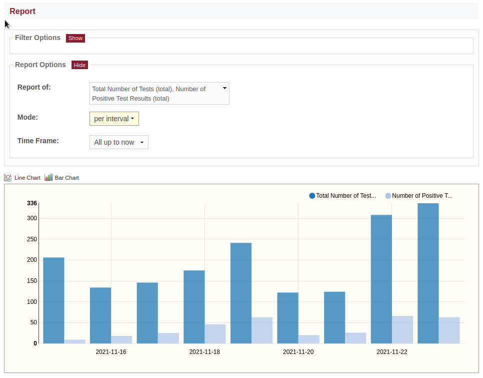

Timeplot
========

Aggregation and visualisation of one or more numeric facts over a time
axis (endpoint: */timeplot*).

\

Configuration
-------------

The ``timeplot_options`` table setting is used to configure the report:

.. code-block:: python
   :caption: Example of timeplot_options configuration

    facts = [(T("Number of Tests"), "sum(tests_total)"),
             (T("Number of Positive Test Results"), "sum(tests_positive)"),
             (T("Number of Reports"), "count(id)"),
             ]

    timeframes = [("All up to now", "", "", ""),
                  ("Last 6 Months", "-6months", "", "weeks"),
                  ("Last 3 Months", "-3months", "", "weeks"),
                  ("Last Month", "-1month", "", "days"),
                  ("Last Week", "-1week", "", "days"),
                  ]

    timeplot_options = {
        "fact": facts,
        "timestamp": [(T("per interval"), "date,date"),
                      (T("cumulative"), "date"),
                      ],
        "time": timeframes,
        "defaults": {"fact": facts[:2],
                     "timestamp": "date,date",
                     "time": timeframes[-1],
                     },
        }

    s3db.configure("disease_testing_report",
                   timeplot_options = timeplot_options,
                   )

The attributes of the ``timeplot_options`` setting are as follows:

+-----------+------+-----------------------------------------------------------------+
|Option     |Type  |Explanation                                                      |
+===========+======+=================================================================+
|fact       |list  |The selectable facts as tuples (label, expression)               |
+-----------+------+-----------------------------------------------------------------+
|timestamp  |list  | | Selectable time stamps as tuples *(label, expr)*              |
|           |      | |                                                               |
|           |      | | If *expr* contains two comma-separated field selectors, it is |
|           |      | | interpreted as "start,end".                                   |
|           |      | |                                                               |
|           |      | | If *expr* is a single field selector, it is interpreted as    |
|           |      | | start date; in this case events are treated as open-ended,    |
|           |      | | and hence facts cumulating over time.                         |
+-----------+------+-----------------------------------------------------------------+
|time       |list  | | List of time frames as tuples *(label, start, end, slots)*    |
|           |      | |                                                               |
|           |      | | *start* and *end* can be either absolute dates (ISO-format),  |
|           |      | | or relative date expressions, or ``""``.                      |
|           |      | |                                                               |
|           |      | | A relative *start* is relative to now.                        |
|           |      | |                                                               |
|           |      | | A relative *end* is relative to *start*, or, if no *start*    |
|           |      | | is specified, it is relative to now.                          |
|           |      | |                                                               |
|           |      | | The *slots* length is the default for the time frame, but can |
|           |      | | be overridden with an explicit slot-selector (see below).     |
+-----------+------+-----------------------------------------------------------------+
|slots      |list  | | List of tuples *(label, expr)*                                |
|           |      | |                                                               |
|           |      | | A separate selector for the slot length is rendered only if   |
|           |      | | this option is configured.                                    |
|           |      | |                                                               |
|           |      | | Otherwise, the slot length is fixed to that specified by the  |
|           |      | | selected time frame option.                                   |
+-----------+------+-----------------------------------------------------------------+
|defaults   |dict  | | Default values for the timeplot options                       |
|           |      | |                                                               |
|           |      | | Same attributes as the top-level attributes, each taking a    |
|           |      | | single item of the respective list (except *fact*, which      |
|           |      | | accepts a list).                                              |
+-----------+------+-----------------------------------------------------------------+
