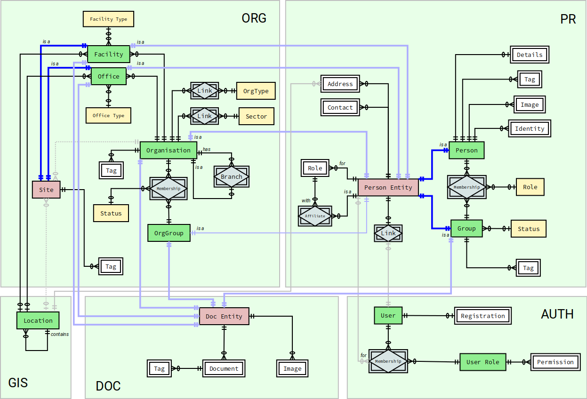

Core Models
===========

Core models form the basis of the Eden ASP database, with the three
central entities *Persons*, *Organisations* and *Locations* representing
the fundamental elements of the user world.

These models are required for essential system functionality, and
must not be disabled.

.. toctree::
   :maxdepth: 2
   :caption: Contents:

   Persons and Groups <pr>
   Organisations and Sites <org>
   Geospatial Information and Maps <gis>
   Document Management <doc>
   User Accounts and Roles <auth>
