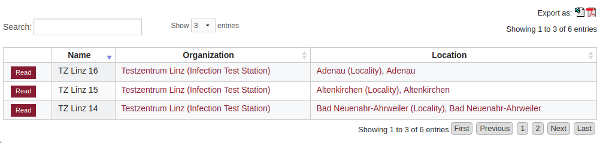
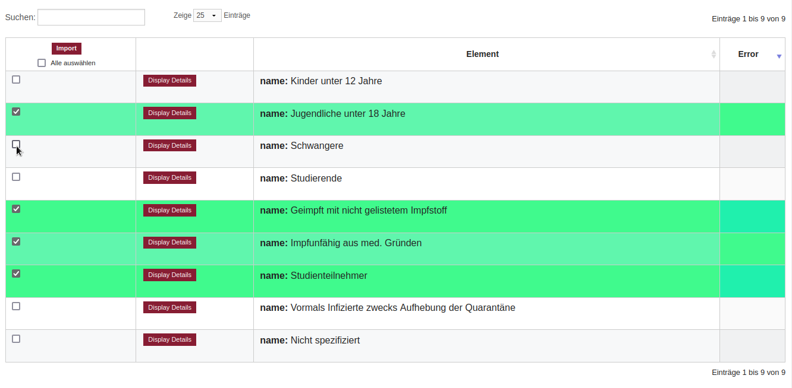

DataTable
=========

The **DataTable** widget represents a set of records as an
interactive HTML table.

DataTables are one of the most common UI features in EdenASP,
and a standard aspect of interactive CRUD.

The ``DataTable`` class implements the server-side functions to
configure, build and update a DataTable. The client-side parts
are implemented by the *s3.ui.datatable.js* script, using
jQuery datatables.

Overview
--------

.. class:: DataTable(rfields, data, table_id=None, orderby=None)

   :param rfields: the table columns, [S3ResourceField, ...]
   :param data: the data, [{colname: value, ...}, ...]
   :param table_id: the DOM ID for the <table> element
   :param orderby: the DAL orderby expression that was used to
                   extract the data

   .. note::

      The first column should be the record ID.

   .. method:: DataTable.html(totalrows, filteredrows, **attr)

      Builds the data table HTML.

      :param totalrows: total number of rows available
      :param filteredrows: total number of rows matching filters
      :param attr: :ref:`build parameters <build-params>`
      :returns: the HTML for the data table widget
      :rtype: FORM

   .. method:: DataTable.json(totalrows, filteredrows, draw, **attr)

      Builds a JSON object to update the data table.

      :param totalrows: total number of rows available
      :param filteredrows: total number of rows matching filters
      :param draw: unaltered copy of "draw" parameter sent from the client
      :param attr: :ref:`build parameters <build-params>`
      :returns: the JSON data
      :rtype: str

.. _dt-example:

Example
-------

Typically, *DataTable* views are implemented in CRUD methods.

The following example implements a *DataTable* view for the *org_facility*
table, including server-side pagination and Ajax-filtering, like this:

\

.. code-block:: python

    class FacilityList(CRUDMethod):

        def apply_method(self, r, **attr):

            get_vars = r.get_vars

            # -----------------------------------------------------------------
            # Pagination

            page_length = 25
            if r.interactive:
                # Default limits when page is first loaded
                # - extracting twice the page length here to fill the cache,
                #   so no Ajax-request is required for the first two pages
                start, limit = 0, 2 * page_length
            else:
                # Dynamic limits for subsequent Ajax-requests
                start, limit = self._limits(get_vars, default_limit=page_length)

            # -----------------------------------------------------------------
            # Extract the data, applying client-side filters/sorting

            resource = current.s3db.resource("org_facility")
            fields = ["id", "name", "organisation_id", "location_id"]

            query, orderby, left = resource.datatable_filter(fields, get_vars)
            if query is not None:
                totalrows = resource.count()
                resource.add_filter(query)

            data = resource.select(fields,
                                   start = start,
                                   limit = limit,
                                   left = left,
                                   orderby = orderby,
                                   count = True,
                                   represent = True,
                                   )

            filteredrows = data.numrows
            if query is None:
                totalrows = filteredrows

            # -----------------------------------------------------------------
            # Set up the DataTable

            from core import DataTable
            dt = DataTable(data.rfields, data.rows, "facility_list")

            # -----------------------------------------------------------------
            # Configure row actions (before building the DataTable)

            current.response.s3.actions = [{"label": "Read",
                                            "url": URL(args = ["[id]", "read"]),
                                            "_class": "action-btn"
                                            },
                                           ]

            # -----------------------------------------------------------------
            # Build the DataTable

            # Rendering parameters to pass to .html() and .json()
            dtargs = {"dt_pagination": True,
                      "dt_pageLength": page_length,
                      "dt_base_url": URL(args=[], vars={}),
                      }

            if r.interactive:
                # This is the initial page load request
                # - build the HTML:
                dt_html = dt.html(totalrows, filteredrows, **dtargs)
                output = {"items": dt_html}

            elif r.representation == "aadata":
                # Client-side script uses the "aadata" extension to request updates
                # - generate a JSON response:
                draw = int(r.get_vars.get("draw", 1))
                output = dt.json(totalrows, filteredrows, draw, **dtargs)

            else:
                r.error(405, current.ERROR.BAD_FORMAT)

            # View template, includes dataTables.html
            current.response.view = "list.html"

            return output

.. note::

   The view template must ``include`` the *dataTables.html* template to add
   the necessary JavaScript for the DataTable widget.

.. _build-params:

Build Parameters
----------------

Both build methods *html()* and *json()* accept the same set of keyword arguments to
control the build of the DataTable. Most of these arguments are optional (see
:ref:`example <dt-example>` above for a typical minimum set).

Basic configuration
"""""""""""""""""""

Basic parameters for the data table.

+----------------+-----+---------+-------------------------------------------------------+
|Keyword         |Type |Default  |Explanation                                            |
+================+=====+=========+=======================================================+
|dt_ajax_url     |str  |None     |URL for Ajax requests                                  |
+----------------+-----+---------+-------------------------------------------------------+
|dt_base_url     |str  |None     |Base URL for exports, usually the resource             |
|                |     |         |default URL without any method or query part           |
+----------------+-----+---------+-------------------------------------------------------+
|dt_dom          |str  |None     | | The jQuery datatable "dom" option,                  |
|                |     |         | | determines the order in which elements are displayed|
|                |     |         | | - see https://datatables.net/reference/option/dom   |
+----------------+-----+---------+-------------------------------------------------------+
|dt_formkey      |str  |None     |A form key (XSRF protection for Ajax requests)         |
+----------------+-----+---------+-------------------------------------------------------+

Pagination
""""""""""

Parameters for pagination (server-side pagination requires *dt_ajax_url*).

+----------------+-----+-------------------------------+-------------------------------------------------------------+
|Keyword         |Type |Default                        |Explanation                                                  |
+================+=====+===============================+=============================================================+
|dt_pagination   |bool |True                           |Enable/disable pagination                                    |
+----------------+-----+-------------------------------+-------------------------------------------------------------+
|dt_pageLength   |int  |25                             | | Default number of records that will be shown per page     |
|                |     |                               | | - the user can change this using the length menu          |
+----------------+-----+-------------------------------+-------------------------------------------------------------+
|dt_lengthMenu   |tuple|[[25, 50, -1], [25, 50, "All"]]|The menu options for the page length                         |
+----------------+-----+-------------------------------+-------------------------------------------------------------+
|dt_pagingType   |str  |deployment setting             | | How the pagination buttons are displayed                  |
|                |     |                               | | - settings.ui.datatables_pagingType (default full_numbers)|
|                |     |                               | | - see https://datatables.net/reference/option/pagingType  |
+----------------+-----+-------------------------------+-------------------------------------------------------------+

Searching
"""""""""

Parameters to control the search box.

+----------------+-----+-------------------------------+-----------------------------------------------------------+
|Keyword         |Type |Default                        |Explanation                                                |
+================+=====+===============================+===========================================================+
|dt_searching    |bool |True                           |Enable/disable search-field                                |
+----------------+-----+-------------------------------+-----------------------------------------------------------+

.. note::

   The search box should normally be disabled when using separate filter forms.

Row Actions
"""""""""""

+----------------+-----+-------------------------------+-----------------------------------------------------------+
|Keyword         |Type |Default                        |Explanation                                                |
+================+=====+===============================+===========================================================+
|dt_row_actions  |list |None                           | | list of actions (each a dict)                           |
|                |     |                               | | - overrides current.response.s3.actions                 |
+----------------+-----+-------------------------------+-----------------------------------------------------------+
|dt_action_col   |int  |0                              |The column where the action buttons will be placed         |
+----------------+-----+-------------------------------+-----------------------------------------------------------+

Bulk Actions
""""""""""""

Bulk-action DataTable views render an additional column with checkboxes
to select rows and then perform actions "in bulk" for all selected rows
with a single button click.

   Spreadsheet Importer: DataTable with bulk action column.

\

+----------------+-----+-------------------------------+-----------------------------------------------------------+
|Keyword         |Type |Default                        |Explanation                                                |
+================+=====+===============================+===========================================================+
|dt_bulk_actions |list |None                           |list of labels for the bulk actions                        |
+----------------+-----+-------------------------------+-----------------------------------------------------------+
|dt_bulk_col     |int  |0                              | | The column in which the checkboxes will appear,         |
|                |     |                               | | - default: insert bulk actions as first column          |
+----------------+-----+-------------------------------+-----------------------------------------------------------+
|dt_bulk_single  |bool |False                          |allow only one row to be selected                          |
+----------------+-----+-------------------------------+-----------------------------------------------------------+
|dt_bulk_selected|list |None                           |list of (pre-)selected items                               |
+----------------+-----+-------------------------------+-----------------------------------------------------------+

.. note::

   Bulk-actions require server-side processing of the DataTable FORM upon submit.

   .. TODO add example

Grouping
""""""""

Group table rows by column values.

+----------------+-----+-------------------------------+-----------------------------------------------------------------+
|Keyword         |Type |Default                        |Explanation                                                      |
+================+=====+===============================+=================================================================+
|dt_group        |list |None                           |The column(s) that is(are) used to group the data                |
+----------------+-----+-------------------------------+-----------------------------------------------------------------+
|dt_group_totals |list |None                           | | The number of record in each group.                           |
|                |     |                               | | - this will be displayed in parenthesis after the group title.|
+----------------+-----+-------------------------------+-----------------------------------------------------------------+
|dt_group_titles |list |None                           | | The titles to be used for each group.                         |
|                |     |                               | | These are a list of lists with the inner list                 |
|                |     |                               | | consisting of two values, the repr from the                   |
|                |     |                               | | db and the label to display. This can be more than            |
|                |     |                               | | the actual number of groups (giving an empty group).          |
+----------------+-----+-------------------------------+-----------------------------------------------------------------+
|dt_group_space  |bool |False                          |Insert a space between the group heading and the next group      |
+----------------+-----+-------------------------------+-----------------------------------------------------------------+
|dt_shrink_groups|str  |None                           | | If set then the rows within a group will be hidden            |
|                |     |                               | | two types are supported, 'individual' and 'accordion'         |
+----------------+-----+-------------------------------+-----------------------------------------------------------------+
|dt_group_types  |str  |None                           | | The type of indicator for groups that can be 'shrunk'         |
|                |     |                               | | Permitted valies are: 'icon' (the default) 'text' and 'none'  |
+----------------+-----+-------------------------------+-----------------------------------------------------------------+

Contents Rendering
""""""""""""""""""

+--------------------+-----+-------------------------------+-----------------------------------------------------------+
|Keyword             |Type |Default                        |Explanation                                                |
+====================+=====+===============================+===========================================================+
|dt_text_maximum_len |int  |80                             |The maximum length of text before it is condensed          |
+--------------------+-----+-------------------------------+-----------------------------------------------------------+
|dt_text_condense_len|int  |75                             |The length displayed text is condensed down to             |
+--------------------+-----+-------------------------------+-----------------------------------------------------------+

Styles
""""""

+----------------+-----+-------------------------------+-----------------------------------------------------------+
|Keyword         |Type |Default                        |Explanation                                                |
+================+=====+===============================+===========================================================+
|dt_styles       |dict |None                           | | dictionary of styles to be applied to a list of ids     |
|                |     |                               | | - example: {"warning" : [1,3,6,,9], "alert" : [2,10,13]}|
+----------------+-----+-------------------------------+-----------------------------------------------------------+
|dt_col_widths   |dict |None                           | | dictionary of columns to apply a width to               |
|                |     |                               | | - example: {1 : 15, 2 : 20}                             |
+----------------+-----+-------------------------------+-----------------------------------------------------------+

Other Features
""""""""""""""

+----------------+-----+-------------------------------+-----------------------------------------------------------+
|Keyword         |Type |Default                        |Explanation                                                |
+================+=====+===============================+===========================================================+
|dt_double_scroll|bool |False                          | | Render double scroll bars (top+bottom), only available  |
|                |     |                               | | with settings.ui.datatables_responsive=False            |
+----------------+-----+-------------------------------+-----------------------------------------------------------+

Response Parameters
-------------------

  *to be written*

Deployment Settings
-------------------

  *to be written*
